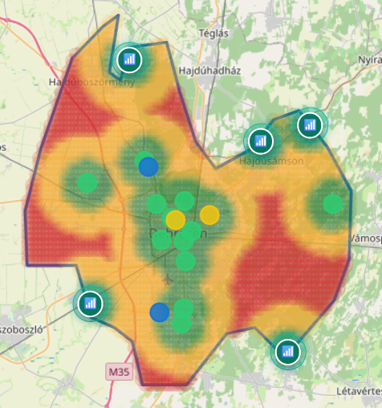
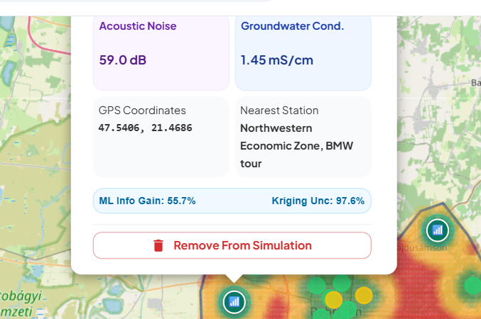
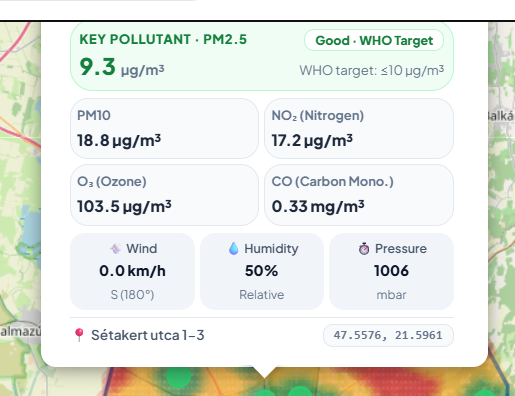
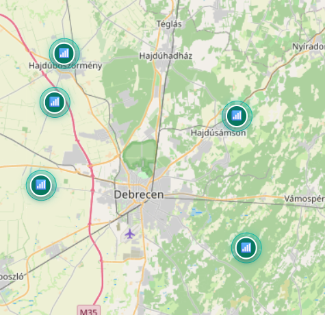
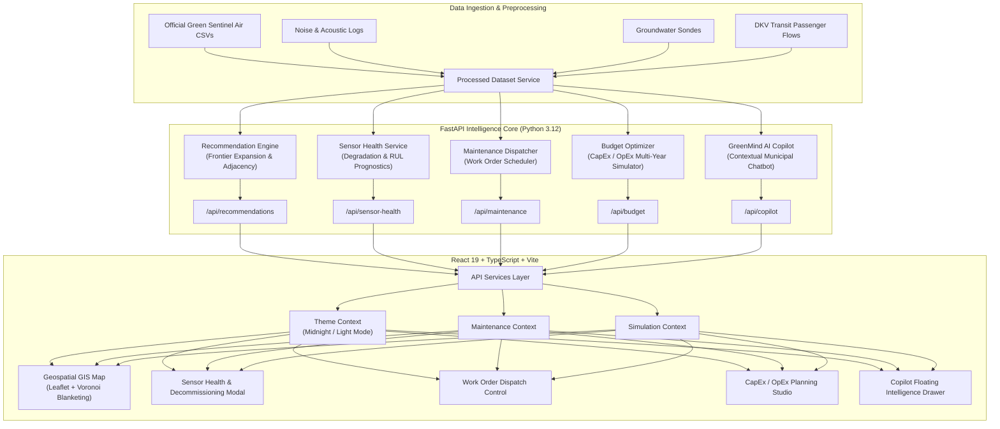

<div align="center">

# 🌿 GreenMind AI
### Autonomous Multi-Environmental Intelligence & Spatial Optimization Platform
**Debrecen Green Sentinel Environmental Monitoring Challenge · Decision Support System**

[](https://fastapi.tiangolo.com)
[](https://www.python.org)
[](https://react.dev)
[](https://www.typescriptlang.org)
[](https://vitejs.dev)
[](https://mui.com)
[](https://leafletjs.com)
[-success?style=for-the-badge&logo=pytest&logoColor=white)](https://docs.pytest.org)

<br/>

<p align="center">
  
</p>

<p align="center">
  <b>GreenMind AI</b> bridges the gap between raw environmental sensor feeds and municipal policy action.<br/>
  It optimizes sensor network expansion using <b>Adjacent Frontier AI placement</b>, forecasts hardware degradation with <b>predictive maintenance</b>, manages the complete sensor lifecycle (including <b>sensor decommissioning</b>), and plans multi-year <b>municipal budgets</b>.
</p>

</div>

---

## 📑 Table of Contents

- [Key Capabilities](#-key-capabilities)
- [Visual Walkthrough & Screenshots](#-visual-walkthrough--screenshots)
- [System Architecture](#-system-architecture)
- [Algorithmic & Mathematical Foundation](#-algorithmic--mathematical-foundation)
  - [Adjacent Frontier Sensor Placement](#1-adjacent-frontier-sensor-placement-algorithm)
  - [Spatial IDW Interpolation](#2-spatial-inverse-distance-weighting-idw)
  - [Multi-Objective Suitability Scoring](#3-multi-objective-environmental-scoring)
  - [Hardware Degradation & RUL Modeling](#4-predictive-maintenance-health-prognostics)
- [Sensor Health & Decommissioning Lifecycle](#-sensor-health--decommissioning-lifecycle)
- [API Reference](#-api-reference)
- [Project Directory Structure](#-project-directory-structure)
- [Quickstart & Installation](#-quickstart--installation)
- [Testing & Quality Verification](#-testing--quality-verification)
- [Author & Credits](#-author--credits)

---

## 🌟 Key Capabilities

1. **Frontier-Adjacent AI Placement Optimizer**
   - Eliminates blind spots by analyzing PM2.5, PM10, NO₂, O₃, acoustic noise, groundwater tables, and DKV public transit mobility.
   - Enforces **contiguity and non-overlapping radius constraints** ($r = 2.0\text{ km}$, separation $\ge 2.4\text{ km}$), first covering immediate adjacent zones of existing stations before expanding outward.

2. **Full GIS Digital Twin & Real-Time Simulation**
   - Interactive Leaflet geospatial map of Debrecen with official stations, AI recommendations, and custom drag-and-drop simulated pins.
   - Live coverage blanketing calculations, sector balancing (North, South, East, West, Airport, Industrial belts), and boundary containment.

3. **Sensor Fleet Health, Diagnostics & Lifecycle Management**
   - Real-time tracking of sensor degradation, signal jitter, baseline drift, packet completeness, and calibration offsets.
   - **Sensor Decommissioning System**: Remove faulty or retired sensors from active monitoring, auto-recalculating fleet diagnostics.
   - Custom sensor registration with automatic prognostic baseline assignment.

4. **Predictive Maintenance (PdM) & Work Orders**
   - Remaining Useful Life (RUL) modeling and automatic triage into `CRITICAL`, `WARNING`, and `OPTIMAL` health tiers.
   - Automated dispatch order creation for field technician crews with localized routing and tool checklists.

5. **CapEx & OpEx Municipal Budget Optimizer**
   - Interactive budget allocation simulator for phased 1-to-5-year municipal planning.
   - Real-time ROI analysis: cost per monitored citizen, cost per km² coverage, and dynamic tier selection (Reference vs. Micro vs. Virtual nodes).

6. **GreenMind AI Copilot**
   - Context-aware autonomous environmental intelligence assistant capable of answering complex municipal queries, explaining anomalies, and guiding planning decisions.

7. **Dual-Theme Operations Control Tower**
   - **Midnight Operations Mode**: High-contrast OLED dark mode engineered for municipal control rooms.
   - **Clean Light Mode**: High-readability light aesthetic designed for public briefings and reports.

---

## 📸 Visual Walkthrough & Screenshots

### 1. Interactive AI Recommendations & Geospatial Optimization
> High-priority monitoring candidates placed contiguously without overlapping sensor radii across Debrecen's urban, academic, and industrial sectors.

<p align="center">
  
</p>

---

### 2. High-Fidelity Environmental Telemetry & Digital Twin
> Proportional telemetry cards displaying estimated PM2.5, WHO target alignment, Class-1 acoustic noise, groundwater conductivity, CapEx/OpEx, and exact GPS coordinates.

<p align="center">
  
  
</p>

---

### 3. Spatial Coverage Blanketing & Multi-Tier Station Management
> Real-time coverage expansion metrics showing active population coverage, unmonitored blind spot percentage, and sector-balanced recommendation rankings.

<p align="center">
  
</p>

---

### 4. Municipal Operations Control Center & Executive Reporting
> Cohesive command dashboard integrating live environmental indices, pollutant distributions, fleet status, and cross-sector telemetry feeds.

<p align="center">
  
</p>

---

## 🏛️ System Architecture



---

## 🔬 Algorithmic & Mathematical Foundation

### 1. Adjacent Frontier Sensor Placement Algorithm
Instead of placing stations arbitrarily or scattering them to rural outer boundaries, GreenMind AI implements **Adjacent Frontier Expansion**:

1. **Immediate Proximity Incentive**:
   For any candidate point $c = (\text{lat}, \text{lng})$, its distance to the nearest existing station is $d_{\min} = \min_{s \in S_{\text{active}}} \|c - s\|_2$.
   - When $2.4\text{ km} \le d_{\min} \le 3.8\text{ km}$, adjacency bonus is maximum ($W_{\text{adj}} = 1.0$).
   - When $d_{\min} > 3.8\text{ km}$, an exponential distance penalty is applied:
     $$P_{\text{dist}} = \exp\bigl(-0.65 \times (d_{\min} - 3.8)\bigr)$$
2. **Contiguous Non-Overlapping Guarantee**:
   Each monitoring station carries an effective radius $R_{\text{cov}} = 2.0\text{ km}$.
   A hard threshold $D_{\text{sep}} \ge 2.4\text{ km}$ combined with an overlap penalty ensures that coverage circles seamlessly touch at their boundaries without wasteful redundancy:
   $$\text{Penalty}_{\text{overlap}} = 1.5 \times \sum_{s \in S_{\text{active}}} \mathbb{I}(\|c - s\|_2 < 2.0\text{ km})$$
3. **Municipal Boundary Containment**:
   Enforces a $1.5\text{ km}$ buffer from Debrecen's outer polygon boundary, preventing sensors from landing outside city limits.

### 2. Spatial Inverse Distance Weighting (IDW)
Environmental attributes (PM2.5, PM10, NO₂, Noise, Groundwater) at unmonitored locations are estimated via power-parameterized spatial interpolation:

$$\hat{Z}(c) = \frac{\sum_{i=1}^{N} \frac{1}{d(c, s_i)^p} Z(s_i)}{\sum_{i=1}^{N} \frac{1}{d(c, s_i)^p}}, \quad p = 2.0$$

### 3. Multi-Objective Environmental Scoring
Candidate sites are evaluated across four normalized environmental dimensions:

$$\text{Priority Score}(c) = 100 \times \left( 0.40 \cdot S_{\text{air}}(c) + 0.25 \cdot S_{\text{noise}}(c) + 0.20 \cdot S_{\text{water}}(c) + 0.15 \cdot S_{\text{transit}}(c) \right) \cdot W_{\text{adj}}(c)$$

### 4. Predictive Maintenance & Health Prognostics
Sensor Remaining Useful Life (RUL) and degradation indices are derived from telemetry stability metrics:

$$\text{Degradation Index} = \alpha \cdot \text{PacketLossRate} + \beta \cdot \frac{\sigma_{\text{jitter}}}{\sigma_{\text{nominal}}} + \gamma \cdot |\text{BaselineDrift}|$$
$$\text{RUL (Days)} = \text{RUL}_{\text{base}} \times \left(1 - \frac{\text{Degradation Index}}{100}\right)$$

---

## 🛠️ Sensor Health & Decommissioning Lifecycle

GreenMind AI provides end-to-end lifecycle management for municipal sensor networks:

1. **Decommission API Endpoint**:
   `DELETE /api/sensor-health/stations/{station_code}`
   - Automatically removes custom stations from active state memory.
   - Registers station codes in `DECOMMISSIONED_STATION_CODES`.
   - Flushes LRU response caches (`get_sensor_health_report.cache_clear()`).
2. **User Interface Controls**:
   - **Quick-Action Card Button**: Dedicated delete button with tooltip on every sensor card.
   - **Diagnostics Modal Action**: Outlined "Decommission Sensor" button inside deep-dive diagnostics.
   - **Confirmation Safety Modal**: Requires user confirmation, displaying clear warnings about data stream archival before executing.
   - **Zero-Reload State Synchronization**: Fleet metrics and lists update instantaneously, accompanied by persistent feedback toasts.

---

## 📡 API Reference

| Method | Endpoint | Description |
| :--- | :--- | :--- |
| `GET` | `/api/recommendations/` | Returns ranked AI sensor placement candidates with multi-objective scores |
| `POST` | `/api/recommendations/simulate` | Evaluates simulated coverage and blind spot reduction for custom sensor sets |
| `GET` | `/api/sensor-health/` | Fetches fleet health status, RUL forecasts, and maintenance triage categories |
| `POST` | `/api/sensor-health/stations` | Registers a new physical or virtual sensor into the active fleet |
| `DELETE`| `/api/sensor-health/stations/{code}` | Decommissions a sensor, removing it from active monitoring and health reports |
| `GET` | `/api/maintenance/schedule` | Retrieves scheduled work orders, field crew assignments, and service routes |
| `POST` | `/api/maintenance/dispatch` | Creates and dispatches a new field service work order |
| `POST` | `/api/budget/optimize` | Calculates multi-year CapEx/OpEx allocation, ROI, and citizen coverage |
| `POST` | `/api/copilot/query` | Submits natural language queries to the context-aware environmental assistant |
| `GET` | `/api/data-quality/` | Returns dataset completeness, outlier statistics, and sensor drift analysis |

---

## 📂 Project Directory Structure

```
GreenMind AI/
├── backend/
│   ├── app/
│   │   ├── main.py                     # FastAPI application entry point & CORS
│   │   ├── routes/
│   │   │   ├── recommendations.py      # Spatial placement & simulation API
│   │   │   ├── sensor_health.py        # Health diagnostics & decommission API
│   │   │   ├── maintenance.py          # Work order dispatch & scheduling API
│   │   │   ├── copilot.py              # Context-aware AI assistant API
│   │   │   ├── official_stations.py    # Official Debrecen monitoring stations
│   │   │   └── data_quality.py         # Data validation & quality metrics
│   │   └── services/
│   │       ├── recommendation_engine.py# Adjacent Frontier Placement Algorithm
│   │       ├── sensor_health_service.py# Fleet prognostics & lifecycle engine
│   │       ├── budget_optimizer.py     # CapEx/OpEx multi-year allocation
│   │       ├── copilot_service.py      # Environmental NLP knowledge engine
│   │       └── processed_dataset_service.py # IDW spatial interpolation & telemetry
│   ├── tests/
│   │   ├── test_ai_analytics.py        # Analytics & spatial test suites
│   │   ├── test_maintenance.py         # Maintenance dispatch test suites
│   │   └── test_sensor_health.py       # Registration & decommission tests
│   ├── requirements.txt                # Python backend dependencies
│   └── pytest.ini                      # Pytest runner configuration
│
├── frontend/
│   ├── src/
│   │   ├── components/
│   │   │   ├── common/                 # BrandLogo, ErrorBoundary, Tables
│   │   │   ├── layout/                 # Topbar, Sidebar, Navigation
│   │   │   ├── map/                    # Leaflet GIS, Layers, Pins, Heatmaps
│   │   │   ├── dashboard/              # Telemetry charts, AQI gauges, glossary
│   │   │   ├── recommendations/        # Budget optimizer, simulation controls
│   │   │   └── copilot/                # Interactive Copilot chat drawer
│   │   ├── context/
│   │   │   ├── ThemeContext.tsx        # Midnight Operations & Light theme state
│   │   │   ├── MaintenanceContext.tsx  # Work order dispatch state
│   │   │   └── SimulationContext.tsx   # Simulated sensor network state
│   │   ├── pages/
│   │   │   ├── Dashboard/              # Central municipal control tower
│   │   │   ├── Recommendations/        # Geospatial placement & frontier optimizer
│   │   │   ├── SensorHealth/           # Health index, diagnostics & decommission
│   │   │   ├── MaintenanceSchedule/    # Field crew dispatch & work orders
│   │   │   ├── BudgetPlanning/         # CapEx/OpEx multi-year allocation
│   │   │   └── DataQuality/            # Sensor validation & completeness audits
│   │   ├── services/                   # API client service layer
│   │   └── theme/                      # Curated HSL tokens for midnight & classic
│   ├── package.json                    # Node dependencies & Vite scripts
│   └── tsconfig.json                   # Strict TypeScript compiler config
│
├── data/                               # Environmental datasets (air, noise, water, transit)
├── docs/                               # Documentation, whitepapers & screenshots
│   └── screenshots/                    # High-resolution application screenshots
└── README.md                           # Project documentation & reference
```

---

## 🚀 Quickstart & Installation

### Prerequisites
- **Python 3.10+** (Tested on Python 3.12)
- **Node.js 18+** & **npm 9+**
- Git

### 1. Clone the Repository
```bash
git clone https://github.com/Sayem-Kabir/greenmind-ai.git
cd greenmind-ai
```

### 2. Backend Setup (FastAPI)
```bash
cd backend

# Create and activate virtual environment
python -m venv .venv

# Windows (PowerShell)
.\.venv\Scripts\activate

# Linux / macOS
source .venv/bin/activate

# Install dependencies
pip install -r requirements.txt

# Start FastAPI server
uvicorn app.main:app --host 127.0.0.1 --port 8000 --reload
```
> The API will be live at `http://127.0.0.1:8000` with interactive Swagger docs at `http://127.0.0.1:8000/docs`.

### 3. Frontend Setup (React + Vite)
```bash
cd ../frontend

# Install dependencies
npm install

# Start Vite development server
npm run dev
```
> The web application will be accessible at `http://localhost:5173`.

---

## 🧪 Testing & Quality Verification

### Run Backend Pytest Suite
```bash
cd backend
pytest backend/tests -v
```
Output:
```text
backend/tests/test_ai_analytics.py ...                                   [ 42%]
backend/tests/test_maintenance.py .                                      [ 57%]
backend/tests/test_sensor_health.py ...                                  [100%]

======================== 7 passed in 3.85s =========================
```

### Run Frontend Production Build & TypeScript Verification
```bash
cd frontend
npm run build
```
Output:
```text
> frontend@0.0.0 build
> tsc -b && vite build

✓ 12,319 modules transformed.
dist/index.html                     0.83 kB │ gzip:   0.46 kB
dist/assets/index-vh-t_kPv.css     15.09 kB │ gzip:   6.36 kB
dist/assets/index-BDsRo-uV.js   1,428.41 kB │ gzip: 409.01 kB
✓ built in 5.29s
```

---

## 👨‍💻 Author & Credits

Developed by **Md. Sayem Kabir**  
- **GitHub**: [@Sayem-Kabir](https://github.com/Sayem-Kabir)  
- **Project**: Debrecen Green Sentinel Environmental Monitoring Challenge  
- **Affiliation**: University of Debrecen  

---

<div align="center">
  <sub>Built with care for the citizens, researchers, and urban planners of Debrecen. 🇭🇺</sub>
</div>
